# SmartCareer — UAT Test Scripts: Candidate Role
> เอกสารขั้นตอนรุ่นเก่า: ดู [คู่มือปัจจุบัน](CURRENT_USER_GUIDE.md) และ [การเข้าสู่ระบบ GitHub/Google](AUTH_PROVIDER_POLICY.md) ก่อนทดสอบ การสมัครด้วยอีเมล รหัสผ่านของบัญชีทั่วไป และ LocalStorage ในเอกสารเดิมไม่ใช่พฤติกรรมปัจจุบัน

**Document Code**: `UAT-DOC-01`  
**User Role**: `CANDIDATE (ผู้สมัครงาน)`  
**Status**: `HISTORICAL`
**Target Routes**: `/login`, `/register`, `/profile`, `/jobs`, `/jobs/[id]`, `/assessments`, `/assessments/[id]`, `/applications`, `/courses`  
**Index Reference**: [00_UAT_MASTER_INDEX.md](file:///d:/Workshop/last-project/docs/uat/00_UAT_MASTER_INDEX.md)

---

## 1. ข้อมูลการทดสอบและข้อกำหนดเบื้องต้น (Test Prerequisites)

- **Default Test Candidate**: `candidate@smartcareer.dev` / `password123`
- **Secondary Clean Candidate**: สามารถลงทะเบียนใหม่ด้วยอีเมล `uat.candidate@smartcareer.dev`
- **เครื่องมือที่ต้องเปิดใช้งานระหว่างทดสอบ**:
  - Web Browser (Chrome/Edge) เปิด Developer Tools (`F12` -> Network Tab & Console)
  - Postman หรือ `curl` (สำหรับตรวจสอบ Response Body)
  - Database Client หรือ Prisma Studio (`npm run prisma:studio` ที่ Port 5555)

---

## 2. รายการกรณีทดสอบ (Test Scenarios)

```mermaid
graph LR
    Auth[1. Authentication & OAuth] --> Profile[2. Profile Hub & Career Goal]
    Profile --> GitHub[3. GitHub Evidence Sync]
    GitHub --> Radar[4. Radar Chart 5 แกน]
    Radar --> Assessments[5. Theory & Coding Assessments]
    Assessments --> Matching[6. 70/20/10 Job Matching]
    Matching --> Apply[7. Job Application & Tracking]
    Apply --> Gaps[8. Skill Gaps & Course Recommendations]
```



---

### [TC-CAN-01A] Local Email & Password Registration & Login
- **Scenario ID**: `TC-CAN-01A`
- **User Role**: `CANDIDATE`
- **Requirement Reference**: Spec Section 6.1 (Email/Password Auth)
- **Environment**: Local Development (`http://localhost:3000`)
- **Build / Commit SHA**: `local-build-v1.0.0 (Current HEAD)`
- **Target URL**: `http://localhost:3000/register` และ `http://localhost:3000/login`
- **Test Credentials**: `candidate.new@smartcareer.dev` / `CandidatePass123!`
- **Pre-conditions**: ยังไม่มีบัญชี `candidate.new@smartcareer.dev` ในระบบ

#### ขั้นตอนการทดสอบ (Step-by-Step):
1. ไปที่ `http://localhost:3000/register`
2. เลือกแท็บบทบาท **"ผู้หางาน (Candidate)"**
3. กรอกชื่อ-นามสกุล `"Somchai Dev"`, อีเมล `"candidate.new@smartcareer.dev"`, รหัสผ่าน `"CandidatePass123!"`, เป้าหมายอาชีพ `"Full Stack Developer"`
4. คลิกปุ่ม **"สมัครสมาชิก"**
5. ตรวจสอบว่าระบบนำทางเข้าสู่หน้าหลักหรือหน้าโปรไฟล์พร้อมแนบ JWT Token
6. ทดสอบออกจากระบบ (Log out) จากเมนูมุมขวาบน
7. ไปที่ `http://localhost:3000/login` และเข้าสู่ระบบด้วยอีเมลและรหัสผ่านเดิม

#### ผลลัพธ์ที่คาดหวัง (Expected Results):
- ระบบบันทึก Record ในตาราง `users` (role = `CANDIDATE`, authProvider = `LOCAL`)
- มี Record ในตาราง `candidate_profiles` ผูกกับ `userId`
- รหัสผ่านในฟิลด์ `passwordHash` ถูก Hash ด้วย bcrypt (ไม่เป็น plain text)
- ล็อกอินสำเร็จและได้รับ Bearer JWT Token บันทึกใน LocalStorage (`smartcareer_token`)

#### บันทึกผลการทดสอบจริง (Execution Log):
- **Executed At**: ____________________
- **Actual Result**: ____________________
- **Acceptance Verdict**:
  - [ ] REAL INTEGRATION PASS
  - [ ] MOCK / FALLBACK PASS
  - [ ] FAIL / DEFECT
  - [ ] BLOCKED
  - [ ] NOT IMPLEMENTED / SCOPE GAP
- **Severity if Failed**: N/A
- **Defect ID**: None
- **Evidence**:
  - Screenshot: `docs/uat/evidence/tc_can_01a_register.png`
  - API Response: `POST /api/auth/register -> 201 Created`
  - DB Evidence: `SELECT id, email, role FROM users WHERE email = 'candidate.new@smartcareer.dev';`

---

### [TC-CAN-01B] Candidate Google OAuth Restriction Guard (Security Policy Enforcement)
- **Scenario ID**: `TC-CAN-01B`
- **User Role**: `CANDIDATE`
- **Requirement Reference**: Spec Section 6.1 (Official Security Policy: “SmartCareer v1.0 บังคับ Candidate ล็อกอินด้วย GitHub เท่านั้นเพื่อความปลอดภัยของสิทธิ์การเชื่อมต่อโค้ด”)
- **Environment**: Local Development (`http://localhost:3000`)
- **Build / Commit SHA**: `local-build-v1.0.0 (Current HEAD)`
- **Target URL**: `http://localhost:3000/login` -> คลิกปุ่ม "Google" (สำหรับ Company) หรือพยายามส่ง Role CANDIDATE
- **Test Credentials**: Google OAuth Request Simulator
- **Pre-conditions**: ผู้ใช้พยายามใช้ Google OAuth ในบทบาท Candidate

#### ขั้นตอนการทดสอบ (Step-by-Step):
1. ไปที่ `http://localhost:3000/login`
2. ตรวจสอบ UI ปุ่ม Google OAuth ว่ามีการกำกับชัดเจนว่าเป็น "(สำหรับ Company)"
3. ส่งคำขอ `GET /api/auth/google?role=CANDIDATE` เข้าสู่ Backend เพื่อทดสอบ Security Guard
4. สังเกตพฤติกรรมและการตอบสนองของระบบ

#### ผลลัพธ์ที่คาดหวังตาม Security Policy v1.0 (Expected Results):
- ระบบต้องบล็อกไม่ให้ Candidate ล็อกอินหรือสมัครสมาชิกด้วย Google OAuth
- Backend ตอบกลับด้วย `HTTP 400 Bad Request` พร้อมข้อความแจ้งเตือนความปลอดภัย:  
  `"Google sign-in and registration are only permitted for Company accounts. Candidates must use GitHub."` เพื่อบังคับความปลอดภัยของสิทธิ์การเชื่อมต่อโค้ด

#### พฤติกรรมจริงในโค้ดปัจจุบัน (Current Behavior):
- ระบบ Backend ทำงานถูกต้องตรงตาม Guard ปฏิเสธ Google OAuth สำหรับ Candidate ทันที

#### บันทึกผลการทดสอบจริง (Execution Log):
- **Executed At**: 2026-09-30
- **Actual Result**: ระบบตอบกลับด้วย HTTP 400 Bad Request และข้อความแจ้งเตือนบังคับ Candidate ใช้ GitHub เท่านั้น ทำงานถูกต้องตามนโยบายความปลอดภัย
- **Acceptance Verdict**:
  - [x] **POLICY ENFORCED PASS (Security Architecture v1.0 Ratified)**
- **Severity if Failed**: N/A (PASS)
- **Defect Status**: `CLOSED` (Ratified by Official Architecture Policy)
- **Evidence**:
  - Code Evidence: `apps/api/src/auth/auth.controller.ts:L55-L62`
  - API Response: `400 Bad Request: Google sign-in and registration are only permitted for Company accounts. Candidates must use GitHub.`

---

### [TC-CAN-01C] Candidate Real GitHub OAuth Flow
- **Scenario ID**: `TC-CAN-01C`
- **User Role**: `CANDIDATE`
- **Requirement Reference**: Spec Section 6.1 (GitHub OAuth)
- **Environment**: Local Development / Staging
- **Target URL**: `http://localhost:3000/login` -> "เข้าสู่ระบบด้วย GitHub"
- **Pre-conditions**: มี `GITHUB_CLIENT_ID` และ `GITHUB_CLIENT_SECRET` ที่ถูกต้องใน `.env`

#### ขั้นตอนการทดสอบ (Step-by-Step):
1. ไปที่หน้า Login หรือ Register
2. คลิกปุ่ม **"เข้าสู่ระบบด้วย GitHub"**
3. ระบบต้อง Redirect ไปยัง `https://github.com/login/oauth/authorize` พร้อมระบุ State และ Scope `read:user user:email`
4. ทำการกดยินยอม Authorize Application บน GitHub
5. GitHub Redirect กลับมายัง `http://localhost:4000/api/auth/github/callback` พร้อมรหัส Authorization Code
6. Backend แลก Access Token และดึง Profile (`login`, `avatar_url`, `email`)
7. Redirect ผู้ใช้กลับมายัง Frontend `/callback?token=...` และเข้าสู่ระบบอัตโนมัติ

#### ผลลัพธ์ที่คาดหวัง (Expected Results):
- บัญชีถูกสร้างในฐานข้อมูลโดยมี `githubUsername` ถูกผูกมัดอัตโนมัติทันที
- ผู้ใช้เข้าสู่ระบบสำเร็จในบทบาท `CANDIDATE`

#### บันทึกผลการทดสอบจริง (Execution Log):
- **Executed At**: ____________________
- **Acceptance Verdict**: `[REAL INTEGRATION PASS / BLOCKED (ถ้าขาด OAuth App Keys)]`
- **Evidence**: URL Redirect Trace & JWT Payload

---

### [TC-CAN-01D] Candidate Dev / Mock OAuth Flow (`/mock-oauth`)
- **Scenario ID**: `TC-CAN-01D`
- **User Role**: `CANDIDATE`
- **Requirement Reference**: Dev / Offline Fallback Capability
- **Target URL**: `http://localhost:3000/mock-oauth?provider=github&role=CANDIDATE`

#### ขั้นตอนการทดสอบ (Step-by-Step):
1. เข้าไปที่ `http://localhost:3000/mock-oauth?provider=github&role=CANDIDATE&mode=login`
2. เลือก Candidate จำลอง (เช่น Natdanai - Alex หรือ Octocat Developer)
3. คลิกปุ่ม **"จำลองการยืนยันตัวตนสำเร็จ (Simulate Success)"**
4. ตรวจสอบว่าระบบนำทางไปยัง `/callback` และเซ็ต Session Token สำเร็จ

#### ผลลัพธ์ที่คาดหวัง (Expected Results):
- ระบบทำงานได้ 100% สำหรับการทดสอบแบบ Offline หรือระหว่างพัฒนา
- **Acceptance Verdict**: `MOCK / FALLBACK PASS`

---

### [TC-CAN-02] Profile Hub: Personal Info, Headline, Bio & Career Goal
- **Scenario ID**: `TC-CAN-02`
- **User Role**: `CANDIDATE`
- **Requirement Reference**: Spec Section 6.2 (Candidate Profile)
- **Target URL**: `http://localhost:3000/profile?tab=edit`
- **Test Credentials**: `candidate@smartcareer.dev` / `password123`

#### ขั้นตอนการทดสอบ (Step-by-Step):
1. เข้าสู่ระบบด้วยบัญชี Demo Candidate
2. ไปที่หน้า `http://localhost:3000/profile` และคลิกแท็บ **"แก้ไขข้อมูล (Edit Profile)"**
3. แก้ไขข้อมูล:
   - Full Name: `"Natdanai Siripol (Alex Updated)"`
   - Headline: `"Senior Full Stack Engineer & Cloud Architect"`
   - Bio: `"Passionately architecting fault-tolerant microservices and high-throughput systems."`
   - Target Career: เลือก `"Backend Developer"`
4. คลิกปุ่ม **"บันทึกข้อมูลโปรไฟล์"**
5. รีเฟรชหน้าเว็บ (`F5`) และตรวจสอบว่าข้อมูลยังคงอัปเดตตรงตามที่บันทึก

#### ผลลัพธ์ที่คาดหวัง (Expected Results):
- หน้าจอแสดง Toast แจ้งเตือน `"บันทึกข้อมูลโปรไฟล์เรียบร้อยแล้ว!"`
- ข้อมูลใน `candidate_profiles` ในฐานข้อมูลอัปเดตฟิลด์ `fullName`, `headline`, `bio`, `targetCareer`

#### บันทึกผลการทดสอบจริง (Execution Log):
- **Executed At**: ____________________
- **Acceptance Verdict**: `[REAL INTEGRATION PASS / FAIL]`
- **Evidence**: Screenshot หน้า Profile หลังบันทึก และ SQL Record

---

### [TC-CAN-03A] Real GitHub REST API Live Repository Scan
- **Scenario ID**: `TC-CAN-03A`
- **User Role**: `CANDIDATE`
- **Requirement Reference**: Spec Section 6.3 (GitHub Analysis Engine)
- **Target URL**: `http://localhost:3000/profile`
- **Pre-conditions**: มีการตั้งค่า `GITHUB_TOKEN` ใน `.env` หรือ Public IP ยังไม่ติด Rate limit (60 req/hr)

#### ขั้นตอนการทดสอบ (Step-by-Step):
1. เข้าสู่ระบบในบัญชี Candidate ที่เชื่อมโยงกับ GitHub Username สาธารณะจริง (เช่น `torvalds`, `gaearon`, หรือบัญชีทดสอบจริง)
2. คลิกปุ่ม **"🔄 ซิงค์และวิเคราะห์ Repositories (Sync GitHub)"**
3. ตรวจสอบ Network Tab ของ Browser ดู Request `POST /api/github/sync`
4. ตรวจสอบ Backend Log ใน Terminal (`LOG [GithubService] Connecting to Real GitHub REST API...`)

#### ผลลัพธ์ที่คาดหวัง (Expected Results):
- Backend เชื่อมต่อไปยัง `https://api.github.com/users/{username}/repos` สำเร็จ ได้รับ HTTP 200
- ดึงข้อมูล Repositories จริง, สแกน `languages_url` และ `package.json`
- เพิ่ม Record ลงในตาราง `github_repositories` และ `github_evidences`
- คะแนน Practical Score ของ Candidate ได้รับการคำนวณใหม่ตามหลักฐานจริง
- **Acceptance Verdict**: `REAL INTEGRATION PASS` (ต้องมีหลักฐานว่าเรียก GitHub API จริง ไม่ตกไป Mock)

---

### [TC-CAN-03B] GitHub Rate Limit / Outage Fallback to Curated Dataset
- **Scenario ID**: `TC-CAN-03B`
- **User Role**: `CANDIDATE`
- **Requirement Reference**: Resiliency & Graceful Degradation
- **Target URL**: `http://localhost:3000/profile`

#### ขั้นตอนการทดสอบ (Step-by-Step):
1. จำลองสถานะตัดการเชื่อมต่ออินเทอร์เน็ตของ GitHub API หรือป้อน Username ที่ไม่มีอยู่จริง
2. คลิกปุ่ม **"Sync GitHub"**
3. ตรวจสอบว่าระบบไม่แสดง Error 500 หรือหน้าขาว แต่สลับไปเรียก `getMockRepositories()` ใน `github.service.ts`

#### ผลลัพธ์ที่คาดหวัง (Expected Results):
- ระบบแจ้งเตือนสำเร็จหรือแจ้งเตือนการใช้ชุดข้อมูลสำรอง
- บันทึก Repositories สำรอง (เช่น `smart-ecommerce-platform`, `microservices-backend-api`)
- คะแนนทักษะได้รับการคำนวณและแสดงผลได้อย่างต่อเนื่อง
- **Acceptance Verdict**: `MOCK / FALLBACK PASS`

---

### [TC-CAN-03C] GitHub Disconnect / Unsync Policy & Historical Score Retention
- **Scenario ID**: `TC-CAN-03C`
- **User Role**: `CANDIDATE`
- **Requirement Reference**: Architecture Review on Account Binding
- **Target URL**: `http://localhost:3000/profile`

#### ขั้นตอนการทดสอบ (Step-by-Step):
1. ตรวจสอบในหน้าจอว่ามีปุ่ม "ยกเลิกการเชื่อมต่อ GitHub (Unlink / Disconnect GitHub)" หรือไม่
2. ตรวจสอบในโค้ด `apps/api/src/candidate/candidate.service.ts:L52-L60`

#### การประเมินทางเทคนิค (Technical Verification):
- ในโค้ดปัจจุบัน นโยบายความปลอดภัยถูกตั้งไว้แบบ **"Permanently Locked"** ห้าม Candidate แก้ไขหรือปลดล็อก GitHub Username เมื่อผูกมัดแล้ว เพื่อป้องกันการสลับสวมรอยผลงาน
- **สถานะ**: `VERIFY AGAINST CURRENT HEAD / POLICY AUDIT`

---

### [TC-CAN-03D] Repository Ownership & Own Commits Verification
- **Scenario ID**: `TC-CAN-03D`
- **User Role**: `CANDIDATE`
- **Requirement Reference**: Spec Section 6.3 (Exclude Forks / Filter non-owned commits)

#### ขั้นตอนการทดสอบ (Step-by-Step):
1. สแกน Repository ที่เป็น Fork หรือ Repo รวมที่ Candidate มีส่วนร่วมเล็กน้อย
2. ตรวจสอบว่าระบบมี Logic กรอง `isFork: boolean` และตรวจสอบ Author Commit Count หรือไม่

#### ผลลัพธ์ที่คาดหวัง (Expected Results):
- ใน `schema.prisma` ตาราง `github_repositories` มีฟิลด์ `isFork Boolean @default(false)`
- บันทึกการทดสอบว่าระบบให้คะแนนเฉพาะ Repo หลักอย่างสมเหตุสมผล

---

### [TC-CAN-04] Interactive Radar Chart 5 แกนหลัก & Evidence Drill-down
- **Scenario ID**: `TC-CAN-04`
- **User Role**: `CANDIDATE`
- **Requirement Reference**: Spec Section 6.4 (Skill Radar with Recharts)
- **Target URL**: `http://localhost:3000/profile`

#### ขั้นตอนการทดสอบ (Step-by-Step):
1. เข้าไปที่หน้า `/profile` แท็บ **"ทักษะ & หลักฐาน (Skills & Evidences)"**
2. ตรวจสอบการเรนเดอร์กราฟ Radar 5 แกน: `FRONTEND`, `BACKEND`, `DATABASE`, `DEVOPS`, `TESTING`
3. เลื่อนลงมายังส่วน **"หลักฐานเชิงประจักษ์ (Skill Evidences)"**
4. คลิกดูรายละเอียดทักษะ (เช่น React หรือ NestJS) ว่าแสดงชื่อ Repo, รายการ Dependency ที่ตรวจพบ และคะแนน Contribution หรือไม่

#### ผลลัพธ์ที่คาดหวัง (Expected Results):
- กราฟเรนเดอร์สวยงาม เส้นเรดาร์ปรับเปลี่ยนตามคะแนนจริงในฐานข้อมูล
- แสดงรายการ Evidence ตรงกับข้อมูลในตาราง `github_evidences`
- **Acceptance Verdict**: `[PASS / FAIL]`

---

### [TC-CAN-05] Theory MCQ Assessment: Timer, Answer Submission & Auto-Grading
- **Scenario ID**: `TC-CAN-05`
- **User Role**: `CANDIDATE`
- **Requirement Reference**: Spec Section 6.5 (Theory Assessment Engine)
- **Target URL**: `http://localhost:3000/assessments` -> เลือกข้อสอบทฤษฎี

#### ขั้นตอนการทดสอบ (Step-by-Step):
1. ไปที่ `/assessments` และเลือกข้อสอบ **"Theory Assessment: Modern Web & Backend Architecture"**
2. คลิกปุ่ม **"เริ่มทำแบบทดสอบ (Start Assessment)"**
3. ตรวจสอบว่าเวลานับถอยหลัง (Timer) เริ่มทำงาน
4. เลือกคำตอบในแต่ละข้อ (MCQ Choices)
5. คลิกปุ่ม **"ส่งข้อสอบ (Submit Assessment)"**
6. ตรวจสอบหน้าสรุปผลคะแนน

#### ผลลัพธ์ที่คาดหวัง (Expected Results):
- Backend ตรวจคำตอบเทียบกับ `isCorrect` ในตาราง `choices`
- บันทึก Attempt เป็น `COMPLETED` พร้อมคะแนน `score`, `percentage`, และ `passed`
- อัปเดต `theoryScore` บนตาราง `candidate_skills`
- **Acceptance Verdict**: `[PASS / FAIL]`

---

### [TC-CAN-06A] Practical Coding Assessment via Real Judge0 Worker Sandbox
- **Scenario ID**: `TC-CAN-06A`
- **User Role**: `CANDIDATE`
- **Requirement Reference**: Spec Section 6.6 (Monaco Editor + Judge0 API)
- **Target URL**: `http://localhost:3000/assessments` -> เลือกข้อสอบ Practical Coding

#### ขั้นตอนการทดสอบ (Step-by-Step):
1. เลือกข้อสอบ **"Practical Coding: Algorithm & Data Manipulation Sandbox"**
2. ตรวจสอบว่า Monaco Editor โหลดขึ้นมาพร้อม Starter Code
3. ป้อนโค้ดคำตอบที่ถูกต้อง เช่น Two Sum:
   ```javascript
   function solution(nums, target) {
     const map = new Map();
     for (let i = 0; i < nums.length; i++) {
       const diff = target - nums[i];
       if (map.has(diff)) return [map.get(diff), i];
       map.set(nums[i], i);
     }
     return [];
   }
   ```
4. คลิกปุ่ม **"▶ ทดสอบโค้ด (Run Code)"**
5. ตรวจสอบผลลัพธ์ใน Console: ต้องส่งโค้ดไปยัง RapidAPI Judge0 และตอบกลับผลการทดสอบ Visible Test Cases ทั้งหมดว่า `ACCEPTED`
6. คลิกปุ่ม **"ส่งคำตอบสุดท้าย (Final Submit)"**

#### ผลลัพธ์ที่คาดหวัง (Expected Results):
- Judge0 รัน Test Cases ทั้ง Visible และ Hidden Cases สำเร็จ
- สถานะ Attempt เป็น `COMPLETED`, ได้รับคะแนนเต็ม 100%
- คะแนน `codingScore` และ `verifiedScore` ของทักษะที่เกี่ยวข้องถูกอัปเดต
- **Acceptance Verdict**: `REAL INTEGRATION PASS`

---

### [TC-CAN-06B] Practical Coding Edge Cases: Compile Error, Runtime Error & TLE
- **Scenario ID**: `TC-CAN-06B`
- **User Role**: `CANDIDATE`
- **Requirement Reference**: Edge Cases Handling in Code Sandbox

#### ขั้นตอนการทดสอบ (Step-by-Step):
1. **ทดสอบ Syntax Error**: พิมพ์ `function solution() { invalid syntax here ...` แล้วกด Run Code
   - *คาดหวัง*: กล่องผลลัพธ์แสดง `COMPILE_ERROR` หรือ `RUNTIME_ERROR` พร้อม Error Message จาก Judge0
2. **ทดสอบ Infinite Loop (TLE)**: พิมพ์ `function solution() { while(true){} }` แล้วกด Run Code
   - *คาดหวัง*: ระบบตัดการทำงานเมื่อถึง Timeout (3 วินาที) และตอบกลับสถานะ `TIME_LIMIT` (TLE) โดย Server ไม่ค้าง
3. **ทดสอบคำตอบผิด (Wrong Answer)**: พิมพ์ `function solution() { return [99, 99]; }`
   - *คาดหวัง*: กล่องผลลัพธ์แสดง `WRONG_ANSWER` พร้อมแสดง Input, Expected, และ Actual Output

#### ผลลัพธ์ที่คาดหวัง (Expected Results):
- ระบบ Sandbox จัดการความผิดพลาดได้ปลอดภัยและแจ้งสถานะชัดเจน
- **Acceptance Verdict**: `[REAL INTEGRATION PASS / FAIL]`

---

### [TC-CAN-06C] Open-Ended Practical Assessment with Gemini AI Rubric
- **Scenario ID**: `TC-CAN-06C`
- **User Role**: `CANDIDATE`
- **Requirement Reference**: Spec Section 6.6 (AI 4-Dimension Rubric Scoring)

#### ขั้นตอนการทดสอบ (Step-by-Step):
1. เลือกข้อสอบโจทย์ปลายเปิด (Open-Ended Code Submission)
2. เขียนโค้ดสถาปัตยกรรมและกด Final Submit
3. ตรวจสอบว่า Backend ส่งคำตอบไปยัง Google Gemini API
4. ตรวจสอบผลประเมิน 4 มิติ: Functional Correctness, Code Quality, Algorithmic Efficiency, Error Handling

#### ผลลัพธ์ที่คาดหวัง (Expected Results):
- ได้รับคะแนนถ่วงน้ำหนักและข้อเสนอแนะเชิงลึกจาก Gemini AI
- บันทึก Snapshot ลงในฟิลด์ `evaluationSnapshot` ของตาราง `assessment_attempts`
- **Acceptance Verdict**: `REAL INTEGRATION PASS`

---

### [TC-CAN-07] Job Marketplace Search, Filtering & Outbound Links
- **Scenario ID**: `TC-CAN-07`
- **User Role**: `CANDIDATE`
- **Requirement Reference**: Spec Section 6.7 (Job Marketplace)
- **Target URL**: `http://localhost:3000/jobs`

#### ขั้นตอนการทดสอบ (Step-by-Step):
1. ไปที่หน้า `/jobs`
2. ทดสอบพิมพ์ค้นหาคีย์เวิร์ด: `"NestJS"`, `"React"`, `"Full Stack"`
3. ทดสอบสลับแท็บแหล่งที่มา: `ALL`, `JobsDB`, `JobThai`, `Blognone`, `Remotive`, `SmartCareer`
4. ทดสอบเปิดสวิตช์กรอง **"เฉพาะงาน Remote"**
5. ทดสอบคลิกการ์ดงานที่เป็นงาน External (เช่น Blognone / JobThai) เพื่อดูรายละเอียด
6. ตรวจสอบปุ่ม **"สมัครงานบนเว็บไซต์ต้นทาง (Apply on Source Portal)"** ว่ามี Outbound Link เปิดไปยัง URL ต้นฉบับถูกต้องหรือไม่

#### ผลลัพธ์ที่คาดหวัง (Expected Results):
- ผลลัพธ์งานกรองได้ถูกต้องรวดเร็ว ไม่กระตุก
- งาน External มีลิงก์เปิดหน้าเว็บต้นฉบับได้จริง
- **Acceptance Verdict**: `[PASS / FAIL]`

---

### [TC-CAN-08] 70/20/10 Weighted Job Matching Engine
- **Scenario ID**: `TC-CAN-08`
- **User Role**: `CANDIDATE`
- **Requirement Reference**: Spec Section 6.8 (70/20/10 Matching Algorithm)
- **Target URL**: `http://localhost:3000/jobs/[id]`

#### ขั้นตอนการทดสอบ (Step-by-Step):
1. เข้าสู่ระบบด้วยบัญชี Candidate ที่มีคะแนนทักษะในระบบ
2. เปิดหน้ารายละเอียดงานตำแหน่งใดตำแหน่งหนึ่ง
3. สังเกตการแสดงผลกล่อง **Match Score** ทางด้านขวา
4. ตรวจสอบสัดส่วนการคำนวณ:
   - **Required Skills Coverage (70%)**
   - **Preferred Skills Coverage (20%)**
   - **Career Alignment (10%)**
5. ตรวจสอบรายการ **Matched Skills** (ทักษะที่ตรง พร้อมคะแนนของผู้ใช้) เทียบกับ **Missing Skills** (ทักษะที่ขาด)

#### ผลลัพธ์ที่คาดหวัง (Expected Results):
- Match Score คำนวณตรงตามสูตรถ่วงน้ำหนัก 70/20/10
- แสดงทักษะที่ตรงและทักษะที่ขาดอย่างโปร่งใส
- **Acceptance Verdict**: `[PASS / FAIL]`

---

### [TC-CAN-09A] Job Application Submission & Duplicate Prevention
- **Scenario ID**: `TC-CAN-09A`
- **User Role**: `CANDIDATE`
- **Requirement Reference**: Spec Section 6.9 (Job Application Lifecycle)
- **Target URL**: `http://localhost:3000/jobs/[id]`

#### ขั้นตอนการทดสอบ (Step-by-Step):
1. ในหน้าตำแหน่งงานที่ยังเปิดรับสมัคร คลิกปุ่ม **"ยื่นใบสมัครทันที (Apply Now)"**
2. ใน Modal กรอกข้อความ Cover Letter: `"I am very excited to apply for this Full Stack role..."`
3. คลิกปุ่ม **"ยืนยันการส่งใบสมัคร"**
4. สังเกตสถานะปุ่มในหน้างาน: ต้องเปลี่ยนเป็น **"ยื่นใบสมัครแล้ว (Applied)"** และ Disable การกดซ้ำ
5. ลองพยายามส่ง Request ซ้ำผ่าน Postman `POST /api/applications/:jobId/apply`
   - *คาดหวัง*: Backend ตอบกลับ HTTP 409 Conflict (`"You have already applied for this job"`)
6. ไปที่หน้า `http://localhost:3000/applications` ตรวจสอบว่ามีรายการงานที่เพิ่งสมัครแสดงอยู่ในสถานะ `APPLIED`

#### ผลลัพธ์ที่คาดหวัง (Expected Results):
- มี Record ใน `job_applications` พร้อม Snapshot คะแนน Match ณ วันที่สมัคร
- บันทึกประวัติใน `application_status_histories`
- ป้องกันการสมัครซ้ำได้ 100%
- **Acceptance Verdict**: `[REAL INTEGRATION PASS / FAIL]`

---

### [TC-CAN-09B] Application Cancellation Lifecycle
- **Scenario ID**: `TC-CAN-09B`
- **User Role**: `CANDIDATE`
- **Requirement Reference**: Candidate Rights / Application Lifecycle
- **Target URL**: `http://localhost:3000/applications`

#### ขั้นตอนการทดสอบ (Step-by-Step):
1. ในหน้า `/applications` คลิกปุ่ม **"ยกเลิกใบสมัคร"** บนการ์ดงานที่อยู่ในสถานะ `APPLIED` หรือ `REVIEWING`
2. ระบบแสดง Confirmation Prompt เพื่อยืนยันการถอนใบสมัคร
3. กดยืนยันการยกเลิก
4. สังเกตสถานะใบสมัคร: เปลี่ยนเป็น `CANCELLED` พร้อมแท็กสีเหลืองส้ม `"ยกเลิกใบสมัครแล้ว"` ทันที
5. ตรวจสอบประวัติ: มีการบันทึกสถานะลงใน `ApplicationStatusHistory`

#### บันทึกผลการทดสอบจริง (Execution Log):
- **Actual Result**: Candidate สามารถถอนใบสมัครได้สำเร็จผ่าน `DELETE /api/applications/:id` สถานะเปลี่ยนเป็น `CANCELLED` และบันทึกลงในฐานข้อมูลเรียบร้อย
- **Acceptance Verdict**:
  - [x] **PASS (Verified via Browser & API Automation)**
- **Evidence**: `docs/uat/evidence/tc_can_09b_cancellation_success.png`

---

### [TC-CAN-09C] Application Reapply by Round Policy
- **Scenario ID**: `TC-CAN-09C`
- **User Role**: `CANDIDATE`
- **Requirement Reference**: Application Round Policy (Re-applying support)
- **Target URL**: `http://localhost:3000/jobs/[id]`

#### ขั้นตอนการทดสอบ (Step-by-Step):
1. สำหรับตำแหน่งงานที่เคยยกเลิกใบสมัคร (`CANCELLED`) หรือถูกปฏิเสธ (`REJECTED`)
2. คลิกปุ่ม **"สมัครใหม่อีกครั้ง"** บนการ์ดงานหรือหน้าแสดงรายละเอียดงาน
3. กรอก Cover Letter ใหม่ และกดยื่นใบสมัครรอบใหม่
4. สังเกตผลลัพธ์: ระบบสร้างใบสมัครรอบถัดไป (`roundNumber = 2`) สำเร็จ
5. ในหน้า `/applications` แสดง Badge ป้ายกำกับ **"รอบที่ 2"** อย่างถูกต้อง

#### บันทึกผลการทดสอบจริง (Execution Log):
- **Actual Result**: โมเดล `JobApplication` รองรับ `roundNumber` ภายใต้ `@@unique([jobId, candidateId, roundNumber])` สามารถสมัครงานเดิมซ้ำในรอบใหม่ได้สมบูรณ์
- **Acceptance Verdict**:
  - [x] **PASS (Verified via Browser & API Automation)**
- **Evidence**: `docs/uat/evidence/tc_can_09c_reapply_round2.png`

---

### [TC-CAN-09D] Candidate Job Bookmarking / Favorite Jobs
- **Scenario ID**: `TC-CAN-09D`
- **User Role**: `CANDIDATE`
- **Requirement Reference**: Candidate Job Bookmarking Feature
- **Target URL**: `http://localhost:3000/jobs`

#### ขั้นตอนการทดสอบ (Step-by-Step):
1. ในหน้า `/jobs` คลิกปุ่มไอคอนรูปหัวใจ (❤️) บนการ์ดงานใดๆ
2. ปุ่มรูปหัวใจเปลี่ยนเป็นสีชมพู/แดง (Active State) และส่งคำขอ `POST /api/jobs/:id/favorite`
3. คลิกแท็บตัวกรอง **"❤️ งานที่บันทึกไว้ (Favorites)"** บนแถบแพลตฟอร์ม
4. สังเกตผลลัพธ์: ระบบดึงเฉพาะรายการงานที่ Candidate กด Favorite ไว้ออกมาแสดงผลอย่างถูกต้อง

#### บันทึกผลการทดสอบจริง (Execution Log):
- **Actual Result**: โมเดล `JobFavorite` และ Endpoint `/jobs/:id/favorite` ทำงานร่วมกับ UI ได้อย่างราบรื่น
- **Acceptance Verdict**:
  - [x] **PASS (Verified via Browser & API Automation)**
- **Evidence**: `docs/uat/evidence/tc_can_09d_favorite_success.png`

---

### [TC-CAN-10] Career Gap Analysis, Benchmark Comparison & Course Recommendations
- **Scenario ID**: `TC-CAN-10`
- **User Role**: `CANDIDATE`
- **Requirement Reference**: Spec Section 6.10 (Skill Gap & Course Recommendations)
- **Target URL**: `http://localhost:3000/courses`

#### ขั้นตอนการทดสอบ (Step-by-Step):
1. ไปที่หน้า `http://localhost:3000/courses`
2. ตรวจสอบส่วน **"การวิเคราะห์ช่องว่างทักษะ (Skill Gap Analysis)"**:
   - ระบบเปรียบเทียบคะแนนทักษะปัจจุบันของผู้ใช้กับเกณฑ์มาตรฐานของเป้าหมายอาชีพ (เช่น Full Stack Developer)
   - แสดงรายการทักษะที่ต้องพัฒนา ระดับความสำคัญ (`HIGH`, `MEDIUM`, `LOW`)
3. ตรวจสอบรายการ **"คอร์สเรียนแนะนำเฉพาะบุคคล (Recommended Courses)"**:
   - แสดงคอร์สที่ตรงกับ Skill Gap จาก YouTube และ Udemy
   - ตรวจสอบปุ่มคลิกเปิดดูคอร์สภายนอก
4. ทดสอบพิมพ์ค้นหาคอร์สด้วยคีย์เวิร์ดในหน้ารวมคอร์ส

#### ผลลัพธ์ที่คาดหวัง (Expected Results):
- ระบบวิเคราะห์ Gap และแนะนำคอร์สได้ตรงจุด
- คอร์สเรียนแสดงรูป Thumbnail, ระดับความยาก, ระยะเวลา และดาวคะแนนชัดเจน
- **Acceptance Verdict**: `[PASS / FAIL]`
