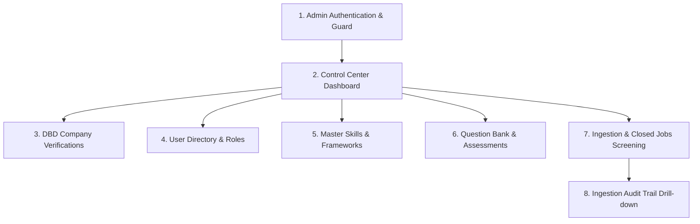

# SmartCareer — UAT Test Scripts: Admin (System Administrator) Role
**Document Code**: `UAT-DOC-03`  
**User Role**: `ADMIN (ผู้ดูแลระบบแพลตฟอร์ม)`  
**Status**: `READY FOR EXECUTION`  
**Target Routes**: `/login`, `/admin/dashboard`, `/admin/verifications`, `/admin/users`, `/admin/skills`, `/admin/assessments`, `/admin/ingestion`  
**Index Reference**: [00_UAT_MASTER_INDEX.md](file:///d:/Workshop/last-project/docs/uat/00_UAT_MASTER_INDEX.md)

---

## 1. ข้อมูลการทดสอบและข้อกำหนดเบื้องต้น (Test Prerequisites)

- **Default Test Admin Account**: `admin@smartcareer.dev` / `admin123`
- **เครื่องมือที่ต้องเปิดใช้งานระหว่างทดสอบ**:
  - Web Browser (Chrome/Edge)
  - Postman (สำหรับทดสอบส่ง Request โดยตรง)
  - PostgreSQL Console หรือ Prisma Studio (`npm run prisma:studio`) เพื่อตรวจสอบตาราง `company_verifications`, `skills`, `skill_frameworks`, `ingestion_logs`

---

## 2. ลำดับขั้นตอนการทดสอบ (Admin Test Flow)

---

### [TC-ADM-01] Admin Authentication & RBAC Guard Protection
- **Scenario ID**: `TC-ADM-01`
- **User Role**: `ADMIN`
- **Requirement Reference**: Spec Section 8.1 (Admin Security & RBAC Guards)
- **Target URL**: `http://localhost:3000/login` -> เข้าสู่ระบบ Admin

#### ขั้นตอนการทดสอบ (Step-by-Step):
1. ไปที่ `http://localhost:3000/login`
2. เข้าสู่ระบบด้วย `admin@smartcareer.dev` / `admin123`
3. ตรวจสอบว่าระบบนำทางเข้าสู่ `/admin/dashboard`
4. ตรวจสอบ Badge แสดงบทบาทใน Navbar มุมขวาบน ต้องแสดงป้ายสีม่วง **`ADMIN`**
5. **ทดสอบ Security Guard**:
   - ออกจากระบบ และล็อกอินเป็น Candidate หรือ Company
   - พยายามพิมพ์ URL ใน Browser เข้าไปที่ `http://localhost:3000/admin/dashboard` โดยตรง
   - ตรวจสอบว่าระบบดีดกลับ (Redirect) หรือบล็อกการเข้าถึง

#### ผลลัพธ์ที่คาดหวัง (Expected Results):
- เฉพาะผู้ใช้ที่มีสิทธิ์ `UserRole.ADMIN` เท่านั้นจึงจะสามารถเข้าถึง `/admin/*` และเรียก API `/api/admin/*` ได้
- ผู้ใช้บทบาทอื่นหรือผู้ที่ยังไม่ล็อกอินจะได้รับ HTTP 403 Forbidden หรือถูก Redirect ออก
- **Acceptance Verdict**: `[REAL INTEGRATION PASS / FAIL]`

---

### [TC-ADM-02] Admin Control Center Dashboard & System Metrics
- **Scenario ID**: `TC-ADM-02`
- **User Role**: `ADMIN`
- **Requirement Reference**: Spec Section 8.2 (Admin Dashboard Telemetry)
- **Target URL**: `http://localhost:3000/admin/dashboard`

#### ขั้นตอนการทดสอบ (Step-by-Step):
1. เข้าไปที่หน้า `/admin/dashboard`
2. ตรวจสอบการแสดงผลตัวเลขสถิติรวมของแพลตฟอร์ม:
   - **จำนวนผู้ใช้งานทั้งหมด (Total Users)**
   - **จำนวนผู้สมัครงาน (Total Candidates)**
   - **จำนวนบริษัทนายจ้าง (Total Companies)**
   - **คำขอรับรองนิติบุคคลที่รอตรวจสอบ (Pending Verifications)**
   - **ตำแหน่งงานที่เปิดรับสมัคร (Active Jobs)**
   - **จำนวนการสมัครงานทั้งหมด (Total Applications)**
   - **จำนวนแบบทดสอบในระบบ (Total Assessments)**
   - **จำนวนคอร์สเรียนในคลัง (Total Courses)**
3. ตรวจสอบตารางประวัติการดูดซับข้อมูลล่าสุด (Recent Ingestion Runs)
4. เปิดฐานข้อมูลเพื่อตรวจนับจำนวนจริง เทียบกับตัวเลขบนหน้าจอ

#### ผลลัพธ์ที่คาดหวัง (Expected Results):
- ตัวเลขสถิติตรงกับความเป็นจริงในฐานข้อมูล 100%
- รายการ Ingestion แสดงสถานะ `SUCCESS`, จำนวนงานที่สร้างใหม่, และจำนวนงานที่ซ้ำอย่างถูกต้อง
- **Acceptance Verdict**: `[PASS / FAIL]`

---

### [TC-ADM-03A] DBD Company Verification Review: Approval Flow
- **Scenario ID**: `TC-ADM-03A`
- **User Role**: `ADMIN`
- **Requirement Reference**: Spec Section 8.3 (DBD Company Verification Workflow)
- **Target URL**: `http://localhost:3000/admin/verifications`
- **Pre-conditions**: มีคำขอรับรองบริษัทอย่างน้อย 1 รายการในสถานะ `PENDING`

#### ขั้นตอนการทดสอบ (Step-by-Step):
1. ไปที่หน้า `/admin/verifications`
2. กรองดูรายการสถานะ **"รอการตรวจสอบ (Pending)"**
3. ตรวจสอบรายละเอียดบริษัท:
   - ชื่อบริษัท, อีเมลติดต่อ, เว็บไซต์
   - เลขทะเบียนนิติบุคคล 13 หลักจากกรมพัฒนาธุรกิจการค้า (DBD)
   - ลิงก์เอกสารแนบ
4. คลิกปุ่มสีเขียว **"อนุมัติการรับรอง (Approve)"**
5. ตรวจสอบ Toast ข้อความแจ้งเตือนความสำเร็จ
6. สลับไปล็อกอินด้วยบัญชี Company ดังกล่าว และไปที่หน้า `/company/dashboard`

#### ผลลัพธ์ที่คาดหวัง (Expected Results):
- ใน `company_verifications` สถานะเปลี่ยนเป็น `VERIFIED`, บันทึก `reviewedBy = adminId`, `reviewedAt = now()`
- ในตาราง `companies` สถานะ `verificationStatus` เปลี่ยนเป็น `VERIFIED`
- บริษัทได้รับตราสัญลักษณ์สีเขียว **"Verified Employer"** และงานของบริษัทได้รับความน่าเชื่อถือ
- **Acceptance Verdict**: `[REAL INTEGRATION PASS / FAIL]`

---

### [TC-ADM-03B] DBD Company Verification Review: Rejection with Reason Flow
- **Scenario ID**: `TC-ADM-03B`
- **User Role**: `ADMIN`
- **Requirement Reference**: Spec Section 8.3 (Rejection Reason Audit)
- **Target URL**: `http://localhost:3000/admin/verifications`

#### ขั้นตอนการทดสอบ (Step-by-Step):
1. ในหน้า `/admin/verifications` เลือกรายการคำขอรับรองที่ข้อมูลไม่สมบูรณ์
2. คลิกปุ่มสีแดง **"ปฏิเสธคำขอ (Reject)"**
3. ป้อนเหตุผลในการปฏิเสธ: `"เลขทะเบียนนิติบุคคลไม่ตรงกับฐานข้อมูลกรมพัฒนาธุรกิจการค้า หรือเอกสารหมดอายุ"`
4. คลิกปุ่มยืนยัน
5. ตรวจสอบรายการในตารางว่าสถานะเปลี่ยนเป็น `REJECTED` พร้อมแสดงเหตุผลที่ระบุ

#### ผลลัพธ์ที่คาดหวัง (Expected Results):
- บันทึกสถานะ `REJECTED` พร้อมฟิลด์ `rejectionReason` ในฐานข้อมูล
- บริษัทสามารถเข้าดูเหตุผลและยื่นเอกสารแก้ไขใหม่ได้
- **Acceptance Verdict**: `[PASS / FAIL]`

---

### [TC-ADM-04] User Account Directory & Role-Based Filtering
- **Scenario ID**: `TC-ADM-04`
- **User Role**: `ADMIN`
- **Requirement Reference**: Spec Section 8.4 (User Directory)
- **Target URL**: `http://localhost:3000/admin/users`

#### ขั้นตอนการทดสอบ (Step-by-Step):
1. ไปที่หน้า `/admin/users`
2. ตรวจสอบตารางรายชื่อบัญชีผู้ใช้งานทั้งหมด
3. ทดสอบช่องค้นหา: พิมพ์ค้นหาด้วยอีเมล หรือชื่อผู้ใช้
4. ทดสอบปุ่มกรองตามบทบาท:
   - คลิกแท็บ `CANDIDATE` -> ตารางต้องแสดงเฉพาะ Candidate
   - คลิกแท็บ `COMPANY` -> ตารางต้องแสดงเฉพาะ Company
   - คลิกแท็บ `ADMIN` -> ตารางต้องแสดงเฉพาะ Admin
5. ตรวจสอบป้ายกำกับสถานะการยืนยันตัวตน และวันที่สร้างบัญชี

#### ผลลัพธ์ที่คาดหวัง (Expected Results):
- รายชื่อค้นหาและกรองได้ถูกต้องรวดเร็ว
- **Acceptance Verdict**: `[PASS / FAIL]`

---

### [TC-ADM-05] Master Skill Management & Industry Frameworks
- **Scenario ID**: `TC-ADM-05`
- **User Role**: `ADMIN`
- **Requirement Reference**: Spec Section 8.5 (Skill Master & Frameworks)
- **Target URL**: `http://localhost:3000/admin/skills`

#### ขั้นตอนการทดสอบ (Step-by-Step):
1. ไปที่หน้า `/admin/skills`
2. ในส่วน **"เพิ่มทักษะหลักเข้าสู่คลัง (Add New Master Skill)"**:
   - ป้อนชื่อทักษะ: `"FastAPI"`
   - เลือกหมวดหมู่ (Category): `BACKEND`
3. คลิกปุ่ม **"บันทึกทักษะหลัก"**
4. ตรวจสอบว่าในรายการทักษะมี `"FastAPI"` ปรากฏขึ้นมาทันที
5. เลื่อนลงมายังส่วน **"โครงสร้างมาตรฐานอุตสาหกรรม (Industry Frameworks)"**:
   - ตรวจสอบรายการ Certification Frameworks เช่น Microsoft Azure, AWS Certified Solutions Architect

#### ผลลัพธ์ที่คาดหวัง (Expected Results):
- ทักษะใหม่ถูกบันทึกลงในตาราง `skills` (slug = `fastapi`)
- ฝั่ง Candidate และ Company สามารถเลือกใช้ทักษะใหม่นี้ในหน้าโปรไฟล์และประกาศงานได้ทันที
- **Acceptance Verdict**: `[REAL INTEGRATION PASS / FAIL]`

---

### [TC-ADM-06] Platform Question Bank & Assessment Management
- **Scenario ID**: `TC-ADM-06`
- **User Role**: `ADMIN`
- **Requirement Reference**: Spec Section 8.6 (Assessment Management)
- **Target URL**: `http://localhost:3000/admin/assessments`

#### ขั้นตอนการทดสอบ (Step-by-Step):
1. ไปที่หน้า `/admin/assessments`
2. ตรวจสอบรายการแบบทดสอบส่วนกลางของแพลตฟอร์ม
3. ทดสอบคลิกปุ่ม **"สร้างแบบทดสอบใหม่ (+ Create Assessment)"**
4. สร้างแบบทดสอบประเภท `THEORY`:
   - ระบุชื่อ, คำอธิบาย, เวลาทำข้อสอบ, คะแนนผ่าน
   - สร้างคำถามปรนัย, ระบุตัวเลือก และกำหนด `isCorrect: true` สำหรับข้อที่ถูกต้อง
5. บันทึกแบบทดสอบ และทดสอบสลับเปิด/ปิดสถานะการใช้งาน (Toggle Active)

#### ผลลัพธ์ที่คาดหวัง (Expected Results):
- บันทึกข้อสอบลงในตาราง `assessments`, `questions`, และ `choices`
- เมื่อสถานะ `isActive = true` ผู้สมัครงานสามารถมองเห็นและเข้าทำข้อสอบได้ในหน้า `/assessments`
- **Acceptance Verdict**: `[PASS / FAIL]`

---

### [TC-ADM-07A] Data Ingestion: Live Job Ingestion Triggers
- **Scenario ID**: `TC-ADM-07A`
- **User Role**: `ADMIN`
- **Requirement Reference**: Spec Section 8.7 (Automated Job Ingestion)
- **Target URL**: `http://localhost:3000/admin/ingestion`

#### ขั้นตอนการทดสอบ (Step-by-Step):
1. ไปที่หน้า `/admin/ingestion`
2. ในส่วน **"สั่งดึงข้อมูลงานทันที (Trigger Live Sync)"**:
   - คลิกปุ่ม **"ดึงงานจาก Remotive (API)"**
   - หรือคลิกปุ่ม **"ดึงงานจาก Blognone (Scraper)"**
3. ตรวจสอบสถานะการทำงาน (Spinner หมุนระหว่างรอ API ภายนอกตอบกลับ)
4. เมื่อทำงานเสร็จ ตรวจสอบข้อความสรุปผล (เช่น Ingestion Completed, สร้างใหม่กี่รายการ, ซ้ำกี่รายการ)
5. รีเฟรชตาราง Audit Logs และตรวจสอบตาราง `jobs` ในฐานข้อมูล

#### ผลลัพธ์ที่คาดหวัง (Expected Results):
- มี Record บันทึกใน `ingestion_logs` สถานะ `SUCCESS`
- ระบบคัดแยกและป้องกันงานซ้ำด้วย `externalId` และ Deduplication Engine
- ตำแหน่งงานใหม่แสดงผลบนหน้าค้นหางานของ Candidate
- **Acceptance Verdict**: `[REAL INTEGRATION PASS / FAIL]`

---

### [TC-ADM-07B] Ingestion Quota Management & Screening Cleanup
- **Scenario ID**: `TC-ADM-07B`
- **User Role**: `ADMIN`
- **Requirement Reference**: Spec Section 8.7 (Ingestion Quota & Closed Job Cleanup)
- **Target URL**: `http://localhost:3000/admin/ingestion`

#### ขั้นตอนการทดสอบ (Step-by-Step):
1. ในหน้า `/admin/ingestion` คลิกปุ่ม **"ตั้งค่าโควตาการดึงข้อมูล (Configure Quotas)"**
2. ปรับตัวเลขโควตาสำหรับแต่ละแหล่งที่มา (เช่น Remotive: 25, Blognone: 20) และคลิกบันทึก
3. เลื่อนลงมายังส่วน **"คัดกรองงานและคอร์สที่ปิดตัวลง (Closed Content Screening & Cleanup)"**:
   - คลิกปุ่ม **"ตรวจสอบล่วงหน้า (Preview Closed Jobs)"**
   - ระบบสแกนหาตำแหน่งงานที่ลิงก์ต้นทางตอบกลับ HTTP 404/410 หรือปิดรับสมัครแล้ว
   - ตรวจสอบรายการใน Modal Preview
4. คลิกปุ่ม **"ทำความสะอาดข้อมูล (Clean Inactive Content)"**

#### ผลลัพธ์ที่คาดหวัง (Expected Results):
- ระบบปรับเปลี่ยนโควตาใน `IngestionConfigService` สำเร็จ
- ระบบสแกนและจัดการงานที่ปิดตัวลงได้อย่างแม่นยำ ไม่กระทบกับตำแหน่งงานที่ยังเปิดอยู่
- **Acceptance Verdict**: `[PASS / FAIL]`

---

### [TC-ADM-08] Ingestion Audit Trail Drill-Down & Error Logging
- **Scenario ID**: `TC-ADM-08`
- **User Role**: `ADMIN`
- **Requirement Reference**: Spec Section 8.8 (Audit Logging)
- **Target URL**: `http://localhost:3000/admin/ingestion`

#### ขั้นตอนการทดสอบ (Step-by-Step):
1. ตรวจสอบตาราง **"ประวัติการทำงานของระบบดึงข้อมูล (Ingestion Audit Trail)"**
2. ตรวจสอบคอลัมน์:
   - แหล่งที่มา (Source)
   - สถานะ (Status: `SUCCESS` / `PARTIAL_SUCCESS` / `FAILED`)
   - เวลาเริ่มต้น - เวลาสิ้นสุด (Started / Finished)
   - จำนวนที่สร้างใหม่ (Created), อัปเดต (Updated), งานซ้ำ (Duplicates), ข้อผิดพลาด (Errors)
3. ตรวจสอบกรณีเกิด Error: ระบบต้องบันทึกข้อความลงในฟิลด์ `errorMessage` ในฐานข้อมูลเพื่อการตรวจสอบย้อนหลัง

#### ผลลัพธ์ที่คาดหวัง (Expected Results):
- Audit Trail มีความสมบูรณ์ โปร่งใส สามารถใช้ตรวจสอบการทำงานของ Cron Schedulers ได้ 100%
- **Acceptance Verdict**: `[PASS / FAIL]`
